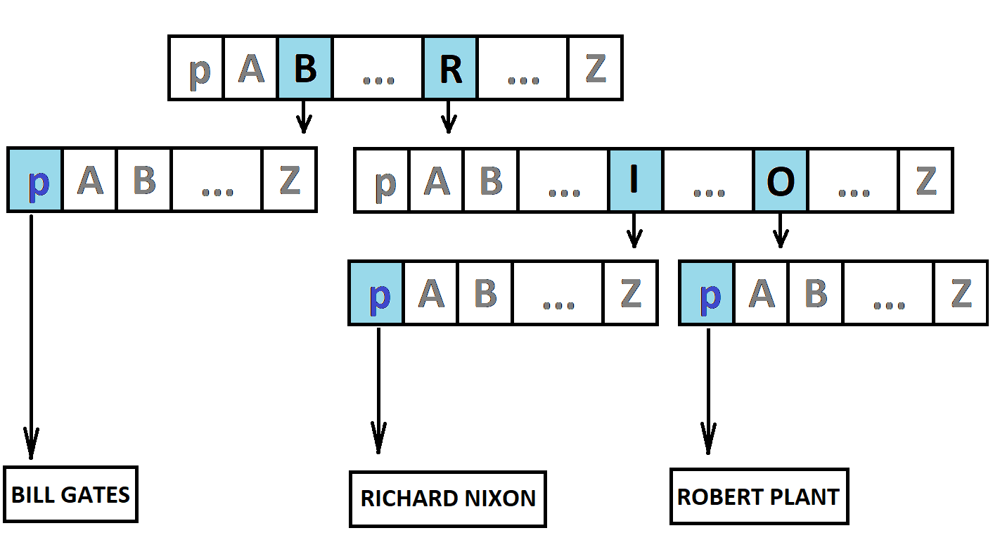

Section A.

This algorithm provides a quick access to the data pointer using a radix tree https://en.wikipedia.org/wiki/Radix_tree
The basic idea is to compare each string key symbol only once. It reduces time access even if there are a lot of elements into the memory.

For a example if we need to storage three notice about famous people, the final structure is:

Where p A B ... Z (blue color) are valid data pointers, p A B ... Z (gray color) are unused pointers, p A B ... Z (black color) are pointers to internal structure.

Section B.

This is the same algorithm for an unsigned key value. The key is split into characters in the same way as a regular string.
Both a key bits and a character bits can be set with the following definitions:
#define KEY_WIDTH
#define KEY_SYMBOL_WIDTH
